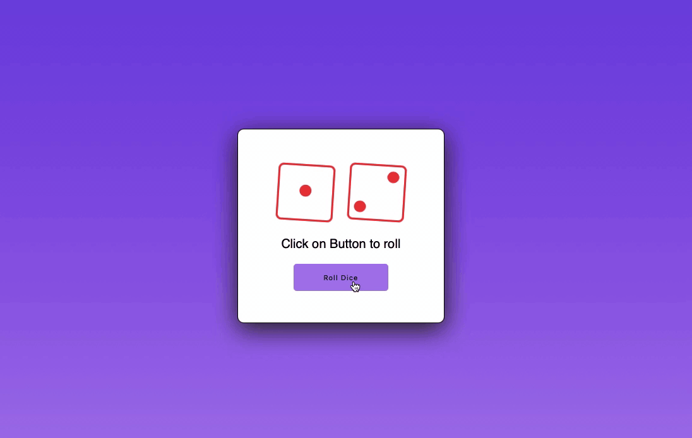

# Dice Roll
Here is the link for the project - https://diceroll-1.netlify.app

This is a simple project which allows user to roll two dices and shows the result on the screen.
This project helped me in better understanding of basic concepts of HTML, CSS, JS.

Project Video
  

